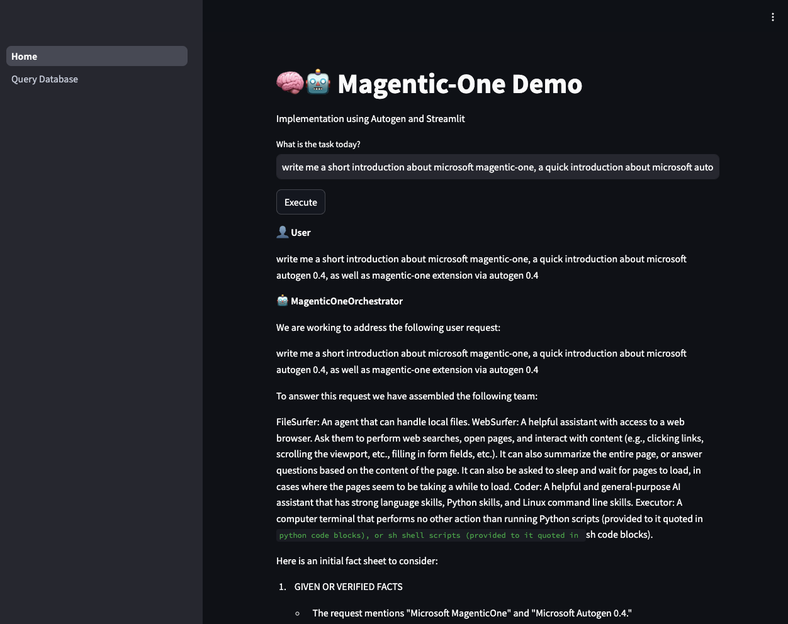

# Magentic-One, Sample Implementation using Streamlit
This is a repo to demostrate an implementation of Magentic-One, using Streamlit and Microsoft Autogen 0.4. The deployment is done via GitOps (Flux and Kustomize) with Kubernetes, and the python apps can run locally as well without deploying to Kubernetes.

At the same time, this repo is also a demo of how to deploy apps to Azure Arc enabled Kubernetes clusters, which can be on-prem or in other clouds.

## Folder Structure
- `magentic-one-streamlit/`: Contains the Streamlit app
- `base`: Contains the yaml to deploy the app to Kubernetes
- `overlays`: Contains the configuration for different environments (cloud, on-prem, etc)

## How to run locally
Refers to the README in `magentic-one-streamlit/` for instructions on how to run the app locally.

## How to deploy to Kubernetes
This implementation is done in Azure Kubernetes Services, as well as Azure Arc enabled Kubernetes clusters. The deployment here assumes you have a Kubernetes cluster ready. The deployment leverages Azure Key Vault as secret provider for the Kubernetes cluster.

### Step 0: Prerequisites
Have a Kubernetes cluster ready, either Azure Kubernetes or Azure Arc enabled Kubernetes. Refers to the following for setting up the cluster:
- [Azure Kubernetes Services](https://learn.microsoft.com/en-us/azure/aks/learn/quick-kubernetes-deploy-portal?tabs=azure-cli)
- [Azure Arc enabled Kubernetes](https://learn.microsoft.com/en-us/azure/azure-arc/kubernetes/quickstart-connect-cluster?tabs=azure-cli)

Next, set up Azure Key Vault and store the secrets required for the deployment. Refers to the following for setting up Azure Key Vault:
- [Azure Key Vault](https://learn.microsoft.com/en-us/azure/key-vault/general/quick-create-portal)

Lastly, setup a container registry to store the container images. Refers to the following for setting up Azure Container Registry:
- [Azure Container Registry](https://learn.microsoft.com/en-us/azure/container-registry/container-registry-get-started-portal?tabs=azure-cli)

Follows the instructions in the README in `magentic-one-streamlit/` to build the container image.

### Step 1: Create service principal for Kubernetes
Create a service principal for the Kubernetes cluster. Refers to the following for creating a service principal:
- [Create service principal](https://learn.microsoft.com/en-us/entra/identity-platform/howto-create-service-principal-portal)

This service principal will be used to perform the following actions:
- Pull the container image from the container registry
- Access secret from Azure Key Vault

### Step 2: Enable Azure Key Vault Provider for Kubernetes
Azure Key Vault Provider for Kubernetes allows you to use Azure Key Vault as a secret provider for Kubernetes. Refers to the following for enabling Azure Key Vault Provider for Kubernetes:
- [Azure Key Vault Provider for Azure Kubernetes Service](https://learn.microsoft.com/en-us/azure/aks/csi-secrets-store-driver)
- [Azure Key Vault Provider for Azure Arc enabled Kubernetes](https://learn.microsoft.com/en-us/azure/azure-arc/kubernetes/tutorial-akv-secrets-provider)

Once the Azure Key Vault Provider is enabled, don't forget to grant the service principal access to the Key Vault. Then, create necessary secrets in Azure Key Vault as per the README in `magentic-one-streamlit/`.

For demo purposes, the apps will deploy in a new namespace within the Kubernetes cluster. Run the following command to create the namespace:
```bash
kubectl create namespace arc-app-demo
```

To enable the authentication via service principal, you need to create a secret in the Kubernetes cluster. Run the following command to create the secret:
```bash
kubectl create secret generic secrets-store-creds --from-literal clientid="xxxxxxxx-xxx-xxxx-xxxx-xxxxxxxxxxxx" --from-literal clientsecret="xxxxxxxxxxxxxx" -n arc-app-demo

kubectl label secret secrets-store-creds secrets-store.csi.k8s.io/used=true -n arc-app-demo
```
Lastly, deploy the Kubernetes sercet provider class. Refers to `csi-secret/akv-sample.yaml` for the sample configuration.
```bash
kubectl deploy -f csi-secret/akv-sample.yaml
```

### Step 3: Deploy the app to Kubernetes
There are two ways to deploy the app to Kubernetes:
1. Using kubectl
2. Using Flux and Kustomize - GitOps

The deployment consist of a single replica of the app, and a service - Load Balancer. The deployment is done in the `base` folder, and the configuration for different environments is done in the `overlays` folder.

#### Using kubectl
Run the following command to deploy the app to Kubernetes:
```bash
kubectl apply -k overlays/cloud # For cloud environment
kubectl apply -k overlays/arc # For azure arc enabled kubernetes
```

#### Using GitOps (Flux and Kustomize) in Kubernetes
Refer to the following guide to setup GitOps in Azure Kubernetes Services or Azure Arc enabled Kubernetes:
- [GitOps in Azure Kubernetes Services](https://learn.microsoft.com/en-us/azure/azure-arc/kubernetes/tutorial-use-gitops-flux2?tabs=azure-portal)

### Step 4: Access the app
Once the deployment is successful, you can access the app via the Load Balancer IP. You will have a public IP for Azure Kubernetes Services, and a private IP (local IP) for Azure Arc enabled Kubernetes, hence access the app accordingly.

## Demo screenshot
#### Download the full video demo here: [Magentic-One Demo Video](https://share.marcustgy.dev/u/rg4DLk.mov)

